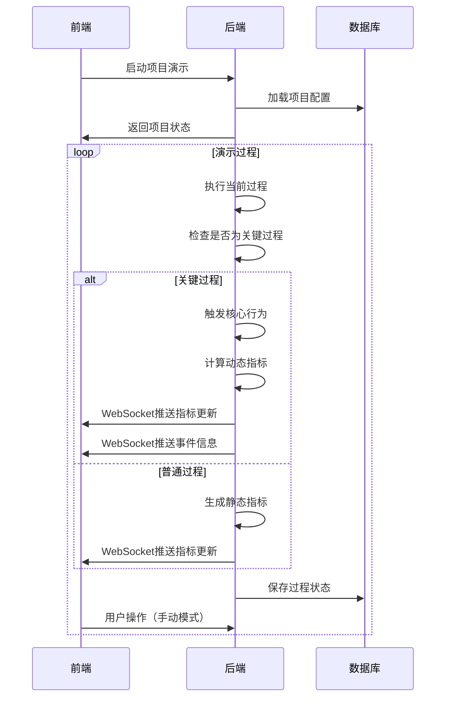

# 效能指标简化实现设计

## 1. 系统架构概述

### 1.1 前后端功能分工

#### 前端负责功能
- **界面展示**：显示时序图、指标仪表盘、事件信息
- **用户交互**：手动/自动模式切换、过程控制、参数配置
- **实时更新**：接收WebSocket推送，实时更新指标显示
- **数据可视化**：图表渲染、指标分类展示、趋势分析

#### 后端负责功能
- **过程模拟**：执行18个过程的模拟逻辑
- **行为触发**：管理5个核心行为的触发和模拟数据生成
- **指标计算**：实时计算5个动态指标，生成45个静态指标
- **数据持久化**：项目状态、过程进度、事件记录的存储
- **WebSocket推送**：向前端推送指标更新和事件信息

### 1.2 交互逻辑



## 2. 前端功能详细设计

### 2.1 界面布局设计

#### 2.1.1 五个核心界面布局

**1. 总览界面 (Overview)**
```
┌─────────────────────────────────────────────────────────┐
│ 顶部导航栏：项目信息、快速操作按钮                        │
├─────────────────────────────────────────────────────────┤
│                                                         │
│              项目基本信息卡片                            │
│         ┌─────────────────────────────┐                │
│         │ 项目名称、状态、进度概览      │                │
│         │ 团队信息、预算使用情况        │                │
│         └─────────────────────────────┘                │
│                                                         │
│  ┌─────────────┐  ┌─────────────┐  ┌─────────────┐    │
│  │   阶段进度   │  │   关键指标   │  │   最近活动   │    │
│  │   可视化     │  │   概览      │  │   时间线     │    │
│  └─────────────┘  └─────────────┘  └─────────────┘    │
│                                                         │
└─────────────────────────────────────────────────────────┘
```

**2. 看板界面 (Dashboard)**
```
┌─────────────────────────────────────────────────────────┐
│ 顶部导航栏：项目信息、模式切换、控制按钮                    │
├─────────────────────────────────────────────────────────┤
│                                                         │
│  ┌─────────────────────────────────────────────────┐    │
│  │              核心动态指标                        │    │
│  │  {{ 当前阶段 }}阶段核心指标 - 实时更新           │    │
│  └─────────────────────────────────────────────────┘    │
│                                                         │
│  ┌─────────────────────────────────────────────────┐    │
│  │              50个指标分类展示                    │    │
│  │  [趋势类15个] [排名类12个] [分布类10个]          │    │
│  │  [概览类8个]  [效率类5个]                       │    │
│  │                                                 │    │
│  │  指标网格展示区域                               │    │
│  └─────────────────────────────────────────────────┘    │
│                                                         │
└─────────────────────────────────────────────────────────┘
```

**3. 里程碑界面 (Milestones)**
```
┌─────────────────────────────────────────────────────────┐
│ 顶部导航栏：里程碑管理、导出功能                          │
├─────────────────────────────────────────────────────────┤
│                                                         │
│  ┌─────────────────────────────────────────────────┐    │
│  │              里程碑时间线                       │    │
│  │  ●────●────●────●────●────●────●────●────●     │    │
│  │  研   建   用   管   维   交付  验收  上线  维护  │    │
│  └─────────────────────────────────────────────────┘    │
│                                                         │
│  ┌─────────────┐  ┌─────────────┐  ┌─────────────┐    │
│  │   已完成     │  │   进行中     │  │   待开始     │    │
│  │   里程碑     │  │   里程碑     │  │   里程碑     │    │
│  │   列表      │  │   详情      │  │   计划      │    │
│  └─────────────┘  └─────────────┘  └─────────────┘    │
│                                                         │
└─────────────────────────────────────────────────────────┘
```

**4. 五阶段模块界面 (UnifiedTimeline)**
```
┌─────────────────────────────────────────────────────────┐
│ 顶部导航栏：阶段切换、过程控制、演示模式                    │
├─────────────┬─────────────────────┬─────────────────────┤
│             │                     │                     │
│   左侧      │      中央区域        │      右侧区域        │
│  完整时序图 │   当前过程详情       │   事件历史           │
│  18个过程   │   任务执行状态       │   影响指标           │
│  当前居中   │   进度显示           │   实时更新           │
│             │                     │                     │
└─────────────┴─────────────────────┴─────────────────────┘
```

#### 2.1.2 各界面核心组件设计

**总览界面组件**
- **项目信息卡片**：项目名称、状态、进度概览、团队信息、预算使用
- **阶段进度可视化**：五阶段进度环形图、完成百分比
- **关键指标概览**：5个核心动态指标的简化显示
- **最近活动时间线**：最近的事件和里程碑活动

**看板界面组件**
- **核心动态指标**：当前阶段的核心指标实时显示
- **50个指标分类展示**：按趋势类、排名类、分布类、概览类、效率类组织
- **指标网格**：响应式网格布局展示各类指标
- **实时更新**：5个动态指标实时更新，45个静态指标过程结束时更新

**里程碑界面组件**
- **里程碑时间线**：五阶段关键节点的可视化
- **已完成里程碑列表**：已完成的里程碑详情
- **进行中里程碑详情**：当前里程碑的执行状态
- **待开始里程碑计划**：未来里程碑的时间安排

**五阶段模块界面组件**
- **完整时序图**：18个过程的交互式显示
- **当前过程详情**：过程基本信息、执行状态、进度
- **任务执行状态**：当前过程的具体任务列表
- **事件历史**：过程相关的事件记录
- **影响指标**：当前过程影响的效能指标

### 2.2 状态管理设计

#### 2.2.1 前端状态结构
- **项目状态**：当前项目、当前阶段、当前过程
- **界面状态**：当前活跃界面、界面间切换状态
- **指标数据**：50个指标的当前值和历史数据
- **事件状态**：当前事件、事件历史记录
- **进度状态**：项目进度、里程碑状态、任务状态
- **连接状态**：WebSocket连接状态

#### 2.2.2 各界面状态管理
- **总览界面**：项目概览数据、阶段进度、关键指标快照
- **看板界面**：50个指标实时数据、核心动态指标状态
- **里程碑界面**：里程碑列表、时间线状态、完成情况
- **五阶段模块界面**：过程详情、任务状态、事件历史、影响指标

#### 2.2.3 状态更新机制
- **指标更新**：接收WebSocket推送，更新指标值和趋势
- **事件显示**：显示当前事件3秒后自动隐藏
- **过程切换**：更新当前过程和阶段状态
- **界面切换**：保持各界面状态，支持快速切换
- **模式切换**：手动/自动/混合模式状态管理

## 3. 后端功能详细设计

### 3.1 核心服务架构

#### 3.1.1 服务层设计
- **项目模拟服务**：管理项目生命周期，协调各服务
- **过程执行引擎**：执行18个过程的模拟逻辑
- **行为模拟引擎**：管理5个核心行为的触发和模拟数据生成
- **指标计算引擎**：实时计算5个动态指标，生成45个静态指标
- **WebSocket服务**：向前端推送指标更新和事件信息

#### 3.1.2 核心功能模块
- **过程管理**：按时序图顺序执行18个过程
- **行为触发**：在关键过程触发5个核心行为
- **指标计算**：动态指标实时计算，静态指标过程结束时生成
- **事件管理**：事件生成、存储和推送
- **状态持久化**：项目状态、过程进度、事件记录存储

## 4. 前后端接口设计

### 4.1 REST API接口

#### 4.1.1 项目管理接口
- **GET /api/projects**：获取项目列表
- **POST /api/projects**：创建项目
- **POST /api/projects/:id/start**：启动项目演示
- **PUT /api/projects/:id/pause**：暂停/恢复项目

#### 4.1.2 各界面数据接口
- **GET /api/projects/:id/overview**：总览界面数据
- **GET /api/projects/:id/dashboard**：看板界面数据
- **GET /api/projects/:id/milestones**：里程碑界面数据
- **GET /api/projects/:id/timeline**：五阶段模块界面数据

#### 4.1.3 指标数据接口
- **GET /api/projects/:id/metrics**：获取项目指标
- **GET /api/projects/:id/metrics/:metricId/history**：获取指标历史数据
- **GET /api/projects/:id/current-event**：获取当前事件

#### 4.1.4 过程控制接口
- **GET /api/projects/:id/current-process**：获取当前过程状态
- **POST /api/projects/:id/next-step**：手动触发下一步
- **PUT /api/projects/:id/mode**：设置演示模式

### 4.2 WebSocket接口

#### 4.2.1 连接管理
- **连接地址**：ws://localhost:3000/metrics?projectId=xxx&clientId=xxx
- **连接成功响应**：返回客户端ID、项目ID、当前状态

#### 4.2.2 消息类型
- **metric-update**：指标更新消息
- **event-trigger**：事件触发消息
- **process-change**：过程变更消息
- **phase-change**：阶段变更消息
- **milestone-update**：里程碑更新消息

### 4.3 数据结构设计

#### 4.3.1 核心数据模型
- **项目模型**：项目基本信息、状态、当前阶段和过程
- **过程实例模型**：过程定义、状态、分配员工、进度信息
- **事件实例模型**：事件类型、状态、触发者、执行数据
- **指标值模型**：指标ID、值、分类、计算时间、趋势
- **里程碑模型**：里程碑定义、状态、完成时间、关联过程
- **任务模型**：任务定义、状态、依赖关系、时间安排

#### 4.3.2 各界面数据需求
- **总览界面**：项目概览、阶段进度、关键指标快照、最近活动
- **看板界面**：50个指标数据、核心动态指标状态
- **里程碑界面**：里程碑列表、时间线、完成状态、计划安排
- **五阶段模块界面**：过程详情、任务状态、事件历史、影响指标

#### 4.3.3 数据库表结构
- **projects**：项目基本信息表
- **process_instances**：过程实例表
- **event_instances**：事件实例表
- **metric_values**：指标值表
- **milestones**：里程碑表
- **tasks**：任务表

#### 4.3.4 实时通信机制
- **WebSocket连接管理**：客户端连接、断开处理
- **消息广播**：向所有客户端或特定项目客户端推送
- **界面特定推送**：根据当前界面推送相关数据
- **错误处理**：连接错误、消息错误处理机制

## 5. 总结

### 5.1 四个界面架构特点
1. **界面分离**：四个独立界面各司其职，功能清晰
2. **数据共享**：各界面共享项目状态和指标数据
3. **实时通信**：WebSocket确保各界面数据实时更新
4. **状态管理**：统一的状态管理支持界面间切换
5. **模块化设计**：各界面组件独立，易于维护和扩展

### 5.2 各界面功能定位
1. **总览界面**：项目概览和快速了解项目状态
2. **看板界面**：效能指标监控和实时数据展示
3. **里程碑界面**：关键节点管理和时间线展示
4. **五阶段模块界面**：详细过程执行和事件历史

### 5.3 技术优势
1. **用户体验**：不同界面满足不同使用场景需求
2. **数据完整性**：完整的状态管理和数据持久化
3. **实时性能**：WebSocket确保数据实时更新
4. **可扩展性**：模块化架构支持功能扩展
5. **维护性**：清晰的界面分离便于维护

### 5.4 实现价值
1. **教学演示**：多界面展示"研建用管维"不同维度
2. **效能分析**：看板界面提供全面的效能监控
3. **里程碑管理**：里程碑界面支持关键节点跟踪
4. **过程跟踪**：五阶段模块界面详细展示执行过程
5. **决策支持**：总览界面提供快速决策信息

这种四界面分离的设计，既保证了功能的专业性，又提供了良好的用户体验，是一个理想的架构方案。

