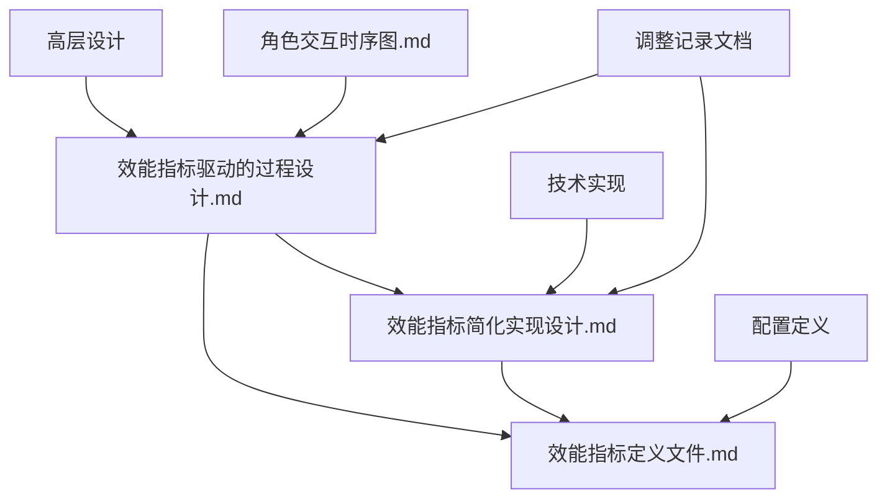

# 效能指标和过程设计文档关系说明

## 文档概述

效能指标和过程设计文件夹包含3个核心设计文档，它们共同构成了"研建用管维"模拟系统的效能指标实现方案。这3个文档从不同层次和角度描述了效能指标的设计、实现和应用。

## 文档关系图



## 各文档详细说明

### 1. 效能指标驱动的过程设计.md
**文档性质**：高层设计文档  
**主要内容**：
- 系统概述和性质说明（模拟系统）
- 50个核心效能指标的精选和分类
- 5个关键动态行为的设计
- 基于时序图演示流程的触发机制
- 前端界面设计（右下角事件显示）
- 18个完整过程定义参考

**设计重点**：
- 基于角色交互时序图的18个过程进行演示
- 5个关键过程（任务2、7、10、17、13）对应5个动态指标
- 前端右下角实时显示当前事件和影响指标
- 45个静态指标在过程结束时更新

**作用**：为整个效能指标系统提供顶层设计思路和架构指导

### 2. 效能指标简化实现设计.md
**文档性质**：技术实现文档  
**主要内容**：
- 系统架构概述（前后端功能分工、交互逻辑）
- 前端功能详细设计（界面布局、组件设计、状态管理）
- 后端功能详细设计（服务架构、数据模型）
- 前后端接口设计（REST API、WebSocket）
- 部署和配置

**技术特点**：
- 前后端分离架构设计
- 完整的接口定义
- WebSocket实时通信
- 模块化服务设计
- 详细的技术实现方案

**作用**：提供具体的技术实现方案和架构设计

### 3. 效能指标定义文件.md
**文档性质**：配置定义文档  
**主要内容**：
- 50个指标的详细配置（JSON格式）
- 5个核心行为的配置和模拟数据
- 指标分类和展示方式
- 5个动态指标的具体配置
- 45个静态指标的预设值规则
- 基于项目配置的预设值计算规则
- 指标配置生成规则

**配置特点**：
- 每个指标都有完整的JSON配置
- 支持基于项目特征的动态计算
- 清晰的指标分类和展示方式
- 灵活的预设值生成规则
- 5个核心行为的详细模拟数据

**作用**：提供指标的具体配置和计算规则

## 文档间的关系

### 1. 层次关系
```
效能指标驱动的过程设计.md (高层设计)
    ↓
效能指标简化实现设计.md (技术实现)
    ↓
效能指标定义文件.md (配置定义)
```

### 2. 内容依赖关系

**效能指标驱动的过程设计.md** 为其他两个文档提供：
- 整体设计思路和架构
- 50个指标的选择和分类
- 5个关键行为的设计
- 前端界面设计思路

**效能指标简化实现设计.md** 基于第一个文档：
- 实现第一个文档中的技术架构
- 提供具体的前后端分离设计
- 设计接口和通信机制
- 实现前端组件和后端服务

**效能指标定义文件.md** 为前两个文档提供：
- 具体的指标配置数据
- 指标计算规则
- 预设值生成逻辑
- 5个核心行为的模拟数据

### 3. 使用流程

1. **设计阶段**：参考《效能指标驱动的过程设计.md》了解整体设计
2. **开发阶段**：按照《效能指标简化实现设计.md》进行技术实现
3. **配置阶段**：使用《效能指标定义文件.md》中的配置进行指标设置

## 核心设计理念

### 1. 基于时序图演示流程
- 严格按照角色交互时序图中的18个任务顺序进行演示
- 5个关键过程在演示时触发动态指标更新
- 前端右下角实时显示当前事件

### 2. 简化实现策略
- **动态指标**：5个（每个阶段1个核心指标）
- **静态指标**：45个（过程结束时一次性赋值）
- **总计**：50个效能指标

### 3. 技术架构特点
- 模拟系统性质，所有过程都是模拟执行
- 支持手动/自动/混合三种演示模式
- 实时指标更新和前端推送
- 完整的数据持久化和状态恢复

## 应用价值

### 1. 教学演示
- 清晰展示"研建用管维"开发过程
- 实时指标更新让演示更生动
- 支持不同教学模式的需求

### 2. 效能分析
- 5个核心指标实时计算
- 45个指标完整覆盖
- 科学的效能度量体系

### 3. 培训工具
- 手动模式适合教学讲解
- 自动模式适合演示展示
- 混合模式适合互动培训

### 4. 管理研究
- 为项目管理和效能度量提供参考
- 支持不同项目模板的指标配置
- 可扩展的架构设计

## 总结

这3个文档构成了一个完整的效能指标设计和实现体系：

- **效能指标驱动的过程设计.md**：提供顶层设计和架构指导
- **效能指标简化实现设计.md**：提供具体的技术实现方案
- **效能指标定义文件.md**：提供详细的配置和计算规则

它们相互配合，从设计理念到技术实现，再到具体配置，形成了一个完整、可操作的效能指标系统。这种分层设计既保证了系统的完整性，又大大降低了实现复杂度，是一个理想的平衡方案。
