### 2.1 基于"研建用管维"阶段的软件开发过程时序图

**设计说明**：
- 按照研建用管维五个阶段重新组织开发过程
- 每个过程包含具体的事件序列，用于效能指标计算
- 管理角色贯穿全生命周期，负责协调和监督
- 支持18个核心过程，覆盖94个效能指标

```mermaid
sequenceDiagram
    participant 研 as 研(研究/研发)
    participant 建 as 建(建设/构建)
    participant 用 as 用(使用/应用)
    participant 管 as 管(管理)
    participant 维 as 维(维护)

    %% 研阶段：需求分析与技术预研
    Note over 研,维: ========== 研阶段：需求分析与技术预研 ==========
    
    %% 任务1：项目启动与规划
    Note over 研,维: 任务1：项目启动与规划
    管->>管: 项目启动
    管->>研: 项目规划指导
    管->>建: 技术团队组建
    管->>用: 用户代表确定
    管->>维: 维护团队准备
    
    %% 任务2：市场调研与需求收集
    Note over 研,维: 任务2：市场调研与需求收集
    研->>研: 市场调研
    用->>研: 用户需求提供
    研->>用: 需求确认
    研->>管: 需求文档提交
    activate 研
    Note over 研: ? 新增需求概览(54)<br/>RSI=1-(变更需求数/总需求数)
    deactivate 研
    管->>管: 需求管理
    
    %% 任务3：技术可行性研究
    Note over 研,维: 任务3：技术可行性研究
    研->>研: 技术预研
    研->>建: 技术方案传递
    建->>建: 技术可行性评估
    建->>研: 技术方案反馈
    研->>管: 技术风险评估
    activate 管
    Note over 管: ? 预估工时按成员排名(69)<br/>EAR=max(0,1-|实际工时-预估工时|/max(预估工时,1))
    deactivate 管
    维->>研: 可维护性建议
    
    %% 任务4：竞品分析与概念验证
    Note over 研,维: 任务4：竞品分析与概念验证
    研->>研: 竞品分析
    研->>建: PoC需求
    建->>建: 原型开发
    建->>研: PoC结果
    研->>用: 概念验证
    用->>研: 用户体验反馈
    activate 用
    Note over 用: ? 需求现状概览(94)<br/>RPE=Σ(已完成需求故事点)/(总需求故事点×经过天数)
    deactivate 用
    研->>管: 项目可行性报告

    %% 建阶段：系统设计与开发构建
    Note over 研,维: ========== 建阶段：系统设计与开发构建 ==========
    
    %% 任务5：系统架构设计
    Note over 研,维: 任务5：系统架构设计
    研->>建: 架构指导
    建->>建: 系统架构设计
    建->>研: 架构方案确认
    建->>管: 架构评审申请
    管->>建: 架构评审
    维->>建: 可维护性要求
    建->>维: 架构可维护性设计
    
    %% 任务6：详细设计与UI/UX设计
    Note over 研,维: 任务6：详细设计与UI/UX设计
    建->>建: 数据库设计
    建->>建: UI/UX设计
    建->>用: 用户体验确认
    用->>建: 用户界面反馈
    建->>管: 设计文档提交
    管->>建: 设计标准要求
    
    %% 任务7：编码实现（细化事件序列）
    Note over 研,维: 任务7：编码实现（细化事件序列）
    建->>建: 代码框架搭建
    建->>建: 核心功能开发
    建->>建: 代码提交
    activate 建
    Note over 建: ? 代码提交趋势(20)<br/>DEI=(有效提交次数×功能点数)/(开发人数×开发天数)
    deactivate 建
    建->>建: 单元测试编写
    建->>建: 代码评审申请
    管->>建: 代码评审反馈
    建->>建: 代码修订
    建->>建: 合并请求
    建->>建: 构建执行
    建->>建: 构建失败
    activate 建
    Note over 建: ? 失败率按任务排名(27)<br/>BuildFailureRate=失败次数/总执行次数
    deactivate 建
    建->>建: 问题修复
    建->>建: 重新构建
    建->>建: 构建成功
    建->>建: 分支合并
    activate 建
    Note over 建: ? 合并请求趋势(17)<br/>MergeRequestTrend=代码集成效率统计
    deactivate 建
    维->>建: 代码质量评估
    建->>维: 代码质量改进
    
    %% 任务8：测试与质量保证
    Note over 研,维: 任务8：测试与质量保证
    建->>建: 单元测试
    建->>建: 集成测试
    建->>用: 用户场景测试
    用->>建: 测试反馈
    建->>管: 测试报告
    activate 建
    Note over 建: ? 代码问题趋势(1)<br/>CQI=max(0,1-缺陷密度/1000)×代码覆盖率×(1-重复率)
    deactivate 建
    管->>建: 质量要求
    维->>建: 可维护性测试

    %% 用阶段：系统部署与应用
    Note over 研,维: ========== 用阶段：系统部署与应用 ==========
    
    %% 任务9：部署准备
    Note over 研,维: 任务9：部署准备
    研->>用: 发布策略指导
    建->>建: 部署环境准备
    建->>用: 部署支持
    管->>管: 发布计划制定
    维->>维: 监控准备
    
    %% 任务10：软件部署与发布
    Note over 研,维: 任务10：软件部署与发布
    用->>用: 软件部署
    activate 用
    Note over 用: ? 运行按流水线排名(30)<br/>DSR=成功部署次数/总部署次数×100%
    deactivate 用
    用->>建: 技术问题反馈
    建->>用: 技术问题解决
    用->>管: 部署状态报告
    管->>用: 发布计划执行
    维->>用: 监控数据提供
    
    %% 任务11：用户培训与推广
    Note over 研,维: 任务11：用户培训与推广
    研->>用: 培训内容设计
    用->>用: 用户培训
    用->>用: 上线推广
    用->>管: 培训效果报告
    管->>用: 推广策略指导
    维->>用: 维护培训
    
    %% 任务12：用户反馈收集
    Note over 研,维: 任务12：用户反馈收集
    用->>用: 用户行为数据分析
    用->>用: 用户反馈收集
    activate 用
    Note over 用: ? 需求交付速率(88)<br/>Lead Time=完成时间-创建时间
    deactivate 用
    用->>维: 问题反馈
    用->>管: 运营数据报告
    用->>研: 用户需求反馈

    %% 维阶段：系统维护与优化
    Note over 研,维: ========== 维阶段：系统维护与优化 ==========
    
    %% 任务13：问题诊断与修复
    Note over 研,维: 任务13：问题诊断与修复
    维->>维: 问题诊断
    维->>研: 问题分析请求
    研->>维: 问题影响评估
    维->>建: 修复需求
    建->>建: 代码修复
    建->>维: 修复结果
    维->>用: 问题验证
    用->>维: 修复确认
    维->>管: 维护报告
    activate 维
    Note over 维: ? 新增缺陷趋势(44)<br/>DFE=已修复缺陷数/总缺陷数×100%
    deactivate 维
    
    %% 任务14：性能优化与功能增强
    Note over 研,维: 任务14：性能优化与功能增强
    维->>维: 性能监控
    维->>研: 优化需求分析
    研->>维: 优化方案
    维->>建: 功能开发需求
    建->>建: 功能开发
    建->>维: 功能交付
    维->>用: 功能测试
    用->>维: 功能验证
    维->>管: 版本管理
    activate 维
    Note over 维: ? 缺陷修复速率(87)<br/>MTTR=Σ故障恢复时间/故障次数
    deactivate 维

    %% 管阶段：项目管理与持续改进
    Note over 研,维: ========== 管阶段：项目管理与持续改进 ==========
    
    %% 任务15：需求重新分析
    Note over 研,维: 任务15：需求重新分析
    维->>研: 维护经验反馈
    用->>研: 新需求反馈
    研->>研: 需求重新分析
    activate 研
    Note over 研: ? 新增需求趋势(45)<br/>RSI=1-(变更需求数/总需求数)
    deactivate 研
    研->>管: 需求管理
    管->>研: 需求优先级
    研->>建: 新需求传递
    
    %% 任务16：功能扩展与版本开发
    Note over 研,维: 任务16：功能扩展与版本开发
    研->>建: 功能规划
    建->>建: 功能开发
    建->>用: 功能测试
    用->>建: 功能反馈
    建->>维: 功能集成
    维->>维: 功能集成测试
    维->>管: 版本发布准备
    
    %% 任务17：版本发布与迭代管理
    Note over 研,维: 任务17：版本发布与迭代管理
    管->>管: 版本管理
    管->>用: 版本发布
    用->>用: 新版本培训
    用->>研: 版本反馈
    管->>研: 迭代管理
    管->>建: 项目管理
    维->>维: 版本维护支持
    管->>管: 版本管理
    activate 管
    Note over 管: ? 迭代燃尽图(4)<br/>PHI=(进度达成率+质量达成率+成本控制率)/3
    deactivate 管

    %% 管理贯穿全生命周期
    Note over 管: 管理贯穿全生命周期<br/>项目管理(进度、成本、资源)<br/>质量管理(代码规范、测试标准)<br/>配置管理(版本控制)<br/>风险管理、安全管理<br/>运营管理(性能监控、日志分析、用户管理)
```

## 时序图说明

### 过程与事件映射

本时序图按照"研建用管维"五个阶段组织，包含18个核心过程：

**研阶段（4个过程）**：
1. 项目启动与规划 - 7个细化事件
2. 市场调研与需求收集 - 8个细化事件  
3. 技术可行性研究 - 8个细化事件
4. 竞品分析与概念验证 - 8个细化事件

**建阶段（4个过程）**：
5. 系统架构设计 - 7个细化事件
6. 详细设计与UI/UX设计 - 7个细化事件
7. 编码实现 - 14个细化事件（含失败重试）
8. 测试与质量保证 - 12个细化事件

**用阶段（4个过程）**：
9. 部署准备 - 7个细化事件
10. 软件部署与发布 - 10个细化事件（含失败处理）
11. 用户培训与推广 - 7个细化事件
12. 用户反馈收集 - 8个细化事件

**维阶段（3个过程）**：
13. 问题诊断与修复 - 10个细化事件
14. 性能优化与功能增强 - 11个细化事件
15. 持续改进与迭代管理 - 8个细化事件

**管阶段（3个过程，贯穿全周期）**：
16. 项目进度管理 - 9个细化事件
17. 团队协作管理 - 7个细化事件
18. 资源配置管理 - 7个细化事件

### 效能指标覆盖

时序图中的事件序列支持94个效能指标的计算，分布如下：
- 研阶段：9个指标
- 建阶段：28个指标
- 用阶段：13个指标
- 管阶段：20个指标  
- 维阶段：24个指标

每个事件都明确定义了对应的效能指标和计算公式，确保实时准确的效能度量。