# 研建用管维UML时序图

## 软件开发生命周期中角色交互时序图

```mermaid
sequenceDiagram
    participant 研 as 研(研究/研发)
    participant 建 as 建(建设/构建)
    participant 用 as 用(使用/应用)
    participant 管 as 管(管理)
    participant 维 as 维(维护)

    %% 需求分析与规划阶段
    Note over 研,维: ========== 需求分析与规划阶段 ==========
    
    %% 任务1：项目启动与规划
    Note over 研,维: 任务1：项目启动与规划
    管->>管: 项目启动
    管->>研: 项目规划指导
    管->>建: 技术团队组建
    管->>用: 用户代表确定
    管->>维: 维护团队准备
    
    %% 任务2：市场调研与需求收集
    Note over 研,维: 任务2：市场调研与需求收集
    研->>研: 市场调研
    用->>研: 用户需求提供
    研->>用: 需求确认
    研->>管: 需求文档提交
    管->>管: 需求管理
    
    %% 任务3：技术可行性研究
    Note over 研,维: 任务3：技术可行性研究
    研->>研: 技术预研
    研->>建: 技术方案传递
    建->>建: 技术可行性评估
    建->>研: 技术方案反馈
    研->>管: 技术风险评估
    维->>研: 可维护性建议
    
    %% 任务4：竞品分析与概念验证
    Note over 研,维: 任务4：竞品分析与概念验证
    研->>研: 竞品分析
    研->>建: PoC需求
    建->>建: 原型开发
    建->>研: PoC结果
    研->>用: 概念验证
    用->>研: 用户体验反馈
    研->>管: 项目可行性报告

    %% 系统设计与开发阶段
    Note over 研,维: ========== 系统设计与开发阶段 ==========
    
    %% 任务5：系统架构设计
    Note over 研,维: 任务5：系统架构设计
    研->>建: 架构指导
    建->>建: 系统架构设计
    建->>研: 架构方案确认
    建->>管: 架构评审申请
    管->>建: 架构评审
    维->>建: 可维护性要求
    建->>维: 架构可维护性设计
    
    %% 任务6：详细设计与UI/UX设计
    Note over 研,维: 任务6：详细设计与UI/UX设计
    建->>建: 数据库设计
    建->>建: UI/UX设计
    建->>用: 用户体验确认
    用->>建: 用户界面反馈
    建->>管: 设计文档提交
    管->>建: 设计标准要求
    
    %% 任务7：编码实现
    Note over 研,维: 任务7：编码实现
    建->>建: 编码实现
    管->>建: 代码规范要求
    建->>管: 代码质量报告
    维->>建: 代码质量评估
    建->>维: 代码质量改进
    
    %% 任务8：测试与质量保证
    Note over 研,维: 任务8：测试与质量保证
    建->>建: 单元测试
    建->>建: 集成测试
    建->>用: 用户场景测试
    用->>建: 测试反馈
    建->>管: 测试报告
    管->>建: 质量要求
    维->>建: 可维护性测试

    %% 部署与应用阶段
    Note over 研,维: ========== 部署与应用阶段 ==========
    
    %% 任务9：部署准备
    Note over 研,维: 任务9：部署准备
    研->>用: 发布策略指导
    建->>建: 部署环境准备
    建->>用: 部署支持
    管->>管: 发布计划制定
    维->>维: 监控准备
    
    %% 任务10：软件部署与发布
    Note over 研,维: 任务10：软件部署与发布
    用->>用: 软件部署
    用->>建: 技术问题反馈
    建->>用: 技术问题解决
    用->>管: 部署状态报告
    管->>用: 发布计划执行
    维->>用: 监控数据提供
    
    %% 任务11：用户培训与推广
    Note over 研,维: 任务11：用户培训与推广
    研->>用: 培训内容设计
    用->>用: 用户培训
    用->>用: 上线推广
    用->>管: 培训效果报告
    管->>用: 推广策略指导
    维->>用: 维护培训
    
    %% 任务12：用户反馈收集
    Note over 研,维: 任务12：用户反馈收集
    用->>用: 用户行为数据分析
    用->>用: 用户反馈收集
    用->>维: 问题反馈
    用->>管: 运营数据报告
    用->>研: 用户需求反馈

    %% 维护与优化阶段
    Note over 研,维: ========== 维护与优化阶段 ==========
    
    %% 任务13：问题诊断与修复
    Note over 研,维: 任务13：问题诊断与修复
    维->>维: 问题诊断
    维->>研: 问题分析请求
    研->>维: 问题影响评估
    维->>建: 修复需求
    建->>建: 代码修复
    建->>维: 修复结果
    维->>用: 问题验证
    用->>维: 修复确认
    维->>管: 维护报告
    
    %% 任务14：性能优化与功能增强
    Note over 研,维: 任务14：性能优化与功能增强
    维->>维: 性能监控
    维->>研: 优化需求分析
    研->>维: 优化方案
    维->>建: 功能开发需求
    建->>建: 功能开发
    建->>维: 功能交付
    维->>用: 功能测试
    用->>维: 功能验证
    维->>管: 版本管理

    %% 持续改进与迭代阶段
    Note over 研,维: ========== 持续改进与迭代阶段 ==========
    
    %% 任务15：需求重新分析
    Note over 研,维: 任务15：需求重新分析
    维->>研: 维护经验反馈
    用->>研: 新需求反馈
    研->>研: 需求重新分析
    研->>管: 需求管理
    管->>研: 需求优先级
    研->>建: 新需求传递
    
    %% 任务16：功能扩展与版本开发
    Note over 研,维: 任务16：功能扩展与版本开发
    研->>建: 功能规划
    建->>建: 功能开发
    建->>用: 功能测试
    用->>建: 功能反馈
    建->>维: 功能集成
    维->>维: 功能集成测试
    维->>管: 版本发布准备
    
    %% 任务17：版本发布与迭代管理
    Note over 研,维: 任务17：版本发布与迭代管理
    管->>管: 版本管理
    管->>用: 版本发布
    用->>用: 新版本培训
    用->>研: 版本反馈
    管->>研: 迭代管理
    管->>建: 项目管理
    维->>维: 版本维护支持

    %% 管理贯穿全生命周期
    Note over 管: 管理贯穿全生命周期<br/>项目管理(进度、成本、资源)<br/>质量管理(代码规范、测试标准)<br/>配置管理(版本控制)<br/>风险管理、安全管理<br/>运营管理(性能监控、日志分析、用户管理)
```

## 角色参与程度说明

| 开发阶段 | 研 | 建 | 用 | 管 | 维 |
|---------|----|----|----|----|----|
| **需求分析与规划** | ★主导 | ●辅助 | ●辅助 | ★主导 | ○参与 |
| **系统设计与开发** | ●辅助 | ★主导 | ●辅助 | ★主导 | ●辅助 |
| **部署与应用** | ●辅助 | ●辅助 | ★主导 | ★主导 | ●辅助 |
| **维护与优化** | ●辅助 | ●辅助 | ●辅助 | ★主导 | ★主导 |
| **持续改进** | ★主导 | ★主导 | ●辅助 | ★主导 | ●辅助 |

**图例说明：**
- ★主导：该阶段的主要负责角色
- ●辅助：重要支持角色
- ○参与：一般参与角色

## 任务执行模式分析

### 1. 需求分析与规划阶段（任务1-4）
- **管**：项目启动和协调管理
- **研**：需求分析和技术研究主导
- **建**：技术可行性评估支持
- **用**：用户需求提供和验证
- **维**：可维护性考虑

### 2. 系统设计与开发阶段（任务5-8）
- **管**：质量管控和进度管理
- **建**：技术实现主导
- **研**：架构指导支持
- **用**：用户体验验证
- **维**：代码质量评估

### 3. 部署与应用阶段（任务9-12）
- **管**：发布管理和运营协调
- **用**：应用推广主导
- **建**：技术保障支持
- **研**：策略指导支持
- **维**：监控准备

### 4. 维护与优化阶段（任务13-14）
- **管**：维护管理和版本控制
- **维**：维护工作主导
- **建**：技术修复支持
- **研**：问题分析支持
- **用**：问题反馈和验证

### 5. 持续改进阶段（任务15-17）
- **管**：迭代管理和项目管理
- **研**：需求重新分析主导
- **建**：功能开发主导
- **用**：需求验证和反馈
- **维**：功能集成支持

## 详细阶段任务分析

### 1. 需求分析与规划阶段

#### 任务1：项目启动与规划
**执行顺序：** 管 → 研/建/用/维
- **管**：项目启动、团队组建、资源分配
- **研**：接收项目规划指导
- **建**：技术团队组建
- **用**：用户代表确定
- **维**：维护团队准备

#### 任务2：市场调研与需求收集
**执行顺序：** 研 ? 用 → 管
- **研**：市场调研、需求分析
- **用**：用户需求提供
- **研**：需求确认
- **管**：需求管理

#### 任务3：技术可行性研究
**执行顺序：** 研 → 建 → 研 → 管
- **研**：技术预研、技术方案传递
- **建**：技术可行性评估、技术方案反馈
- **维**：可维护性建议
- **管**：技术风险评估

#### 任务4：竞品分析与概念验证
**执行顺序：** 研 → 建 → 用 → 管
- **研**：竞品分析、PoC需求
- **建**：原型开发、PoC结果
- **用**：概念验证、用户体验反馈
- **管**：项目可行性报告

### 2. 系统设计与开发阶段

#### 任务5：系统架构设计
**执行顺序：** 研 → 建 → 管/维
- **研**：架构指导
- **建**：系统架构设计、架构方案确认
- **管**：架构评审
- **维**：可维护性要求、架构可维护性设计

#### 任务6：详细设计与UI/UX设计
**执行顺序：** 建 → 用 → 管
- **建**：数据库设计、UI/UX设计
- **用**：用户体验确认、用户界面反馈
- **管**：设计标准要求

#### 任务7：编码实现
**执行顺序：** 建 ? 管/维
- **建**：编码实现
- **管**：代码规范要求
- **维**：代码质量评估、代码质量改进

#### 任务8：测试与质量保证
**执行顺序：** 建 → 用 → 管/维
- **建**：单元测试、集成测试
- **用**：用户场景测试、测试反馈
- **管**：质量要求
- **维**：可维护性测试

### 3. 部署与应用阶段

#### 任务9：部署准备
**执行顺序：** 研/建/管/维 → 用
- **研**：发布策略指导
- **建**：部署环境准备、部署支持
- **管**：发布计划制定
- **维**：监控准备

#### 任务10：软件部署与发布
**执行顺序：** 用 ? 建/管/维
- **用**：软件部署、技术问题反馈
- **建**：技术问题解决
- **管**：发布计划执行
- **维**：监控数据提供

#### 任务11：用户培训与推广
**执行顺序：** 研 → 用 → 管/维
- **研**：培训内容设计
- **用**：用户培训、上线推广
- **管**：推广策略指导
- **维**：维护培训

#### 任务12：用户反馈收集
**执行顺序：** 用 → 研/管/维
- **用**：用户行为数据分析、用户反馈收集
- **研**：用户需求反馈
- **管**：运营数据报告
- **维**：问题反馈

### 4. 维护与优化阶段

#### 任务13：问题诊断与修复
**执行顺序：** 维 → 研 → 建 → 用 → 管
- **维**：问题诊断、修复需求
- **研**：问题分析请求、问题影响评估
- **建**：代码修复、修复结果
- **用**：问题验证、修复确认
- **管**：维护报告

#### 任务14：性能优化与功能增强
**执行顺序：** 维 → 研 → 建 → 用 → 管
- **维**：性能监控、优化需求分析
- **研**：优化方案
- **建**：功能开发需求、功能开发、功能交付
- **用**：功能测试、功能验证
- **管**：版本管理

### 5. 持续改进与迭代阶段

#### 任务15：需求重新分析
**执行顺序：** 维/用 → 研 → 管 → 建
- **维**：维护经验反馈
- **用**：新需求反馈
- **研**：需求重新分析
- **管**：需求管理、需求优先级
- **建**：新需求传递

#### 任务16：功能扩展与版本开发
**执行顺序：** 研 → 建 → 用 → 维 → 管
- **研**：功能规划
- **建**：功能开发
- **用**：功能测试、功能反馈
- **维**：功能集成、功能集成测试
- **管**：版本发布准备

#### 任务17：版本发布与迭代管理
**执行顺序：** 管 → 用 → 研/建/维
- **管**：版本管理、版本发布
- **用**：新版本培训、版本反馈
- **研**：迭代管理
- **建**：项目管理
- **维**：版本维护支持

## 关键观察

### 1. 任务执行顺序特征
- **管**：通常作为任务启动者，负责项目管理和协调
- **研**：在需求分析和技术研究任务中起主导作用
- **建**：在技术实现和开发任务中起主导作用
- **用**：在用户相关任务中起关键作用
- **维**：在维护和优化任务中起主导作用

### 2. 角色间的交互流程
- **管→所有**：项目管理贯穿全生命周期，负责启动和协调
- **研?建**：需求传递与技术实现的协作关系
- **建?用**：产品交付与价值验证的协作关系
- **用?维**：问题反馈与维护响应的协作关系
- **维?研**：维护经验与需求改进的协作关系

### 3. 任务依赖关系
- **顺序依赖**：大部分任务按时间顺序执行
- **并行协作**：同一任务内多个角色可以并行工作
- **反馈循环**：任务间存在反馈机制，形成持续改进
- **管理协调**：管角色负责协调各角色间的任务执行

### 4. 多角色协作模式
- **需求阶段**：研+管为主，建+用+维参与
- **开发阶段**：建+管为主，研+用+维参与
- **应用阶段**：用+管为主，研+建+维参与
- **维护阶段**：维+管为主，研+建+用参与
- **迭代阶段**：研+建+管为主，用+维参与

### 5. 业务逻辑关系
- **需求驱动**：用户需求驱动整个开发流程
- **技术支撑**：技术可行性支撑需求实现
- **质量保证**：质量管控贯穿开发全过程
- **反馈优化**：用户反馈驱动持续改进
- **经验积累**：维护经验反馈到需求分析

### 6. 时序图优势
- **任务细化**：将每个阶段细分为具体任务
- **执行顺序**：清晰显示任务间的执行顺序和依赖关系
- **角色协作**：详细展示角色间的协作流程
- **业务逻辑**：通过箭头展示业务逻辑关系
- **生命周期**：完整展示软件从需求到维护的全过程
- **可操作性**：提供具体的任务执行指导

## 在C4ISR系统中的特殊考虑

### 任务1-4：需求分析与规划阶段
- **研**：战略需求分析、威胁评估、技术预研
- **管**：军方项目管理、安全等级规划
- **建**：军用技术可行性评估、原型验证
- **用**：作战需求提供、战场环境分析
- **维**：军用系统可维护性设计

### 任务5-8：系统设计与开发阶段
- **建**：军用系统架构设计、模块化集成
- **管**：军用标准质量管控、安全认证
- **研**：军用技术指导、标准制定
- **用**：作战场景测试、用户体验验证
- **维**：军用代码质量评估、安全测试

### 任务9-12：部署与应用阶段
- **用**：战场部署、作战人员培训
- **管**：军用发布管理、安全运营
- **建**：军用技术保障、系统集成
- **研**：作战策略指导、战术分析
- **维**：军用监控准备、安全备份

### 任务13-14：维护与优化阶段
- **维**：军用系统维护、安全更新
- **管**：军用维护管理、安全版本控制
- **建**：军用代码修复、安全补丁
- **研**：军用问题分析、安全评估
- **用**：作战问题反馈、系统验证

### 任务15-17：持续改进阶段
- **研**：军用需求重分析、威胁评估更新
- **建**：军用功能开发、安全增强
- **管**：军用迭代管理、安全项目管理
- **用**：作战需求验证、新功能测试
- **维**：军用功能集成、安全测试

## 迭代循环特征

### 持续改进机制
- 从任务17（版本发布与迭代管理）可以回到任务1（项目启动与规划）
- 每个任务循环都会基于前期经验优化后续流程
- 管理职能确保迭代过程的规范性和效率

### 任务间反馈循环
- **任务12→任务15**：用户反馈驱动需求重新分析
- **任务14→任务15**：维护经验驱动需求改进
- **任务17→任务1**：版本反馈驱动新一轮项目规划
- **任务13→任务5**：问题经验驱动架构优化

### 反馈驱动优化
- 用户反馈驱动功能改进（任务12→任务16）
- 维护经验驱动架构优化（任务14→任务5）
- 技术发展驱动系统升级（任务15→任务16）
- 业务需求驱动流程改进（任务17→任务1）

## 总结

"研建用管维"五个角色在瀑布模型中形成有机的协作关系，通过任务细化的UML时序图可以清晰看出：

### 核心特点

1. **任务细化**：将每个开发阶段细分为具体任务，每个任务都有明确的执行顺序
2. **角色协作**：详细展示角色间的协作流程和业务逻辑关系
3. **执行顺序**：通过箭头清晰显示任务间的执行顺序和依赖关系
4. **业务逻辑**：综合考虑不同角色之间的任务顺序，添加横向箭头说明业务逻辑
5. **生命周期**：完整展示软件从需求到维护的全过程

### 关键优势

1. **可操作性**：提供具体的任务执行指导，便于团队实际操作
2. **协作清晰**：明确展示角色间的协作关系和责任分工
3. **流程规范**：标准化的任务执行流程，提高开发效率
4. **质量保证**：通过任务细化确保每个环节的质量控制
5. **持续改进**：反馈机制确保系统的持续优化和迭代

### 适用场景

这种任务细化的模式特别适用于C4ISR等复杂系统，能够确保：
- 系统开发的规范性和可控性
- 角色间的有效协作和沟通
- 开发过程的透明度和可追溯性
- 系统具有强大的作战效能和长期的战略价值

通过标准化的UML时序图表示，便于团队理解、沟通和协作，提高软件开发过程的效率和质量。
