# 研建用管维UML时序图

## 软件开发生命周期中角色交互时序图

```mermaid
sequenceDiagram
    participant 研 as 研(研究/研发)
    participant 建 as 建(建设/构建)
    participant 用 as 用(使用/应用)
    participant 管 as 管(管理)
    participant 维 as 维(维护)

    %% 需求分析与规划阶段
    Note over 研,维: ========== 需求分析与规划阶段 ==========
    
    %% 任务1：项目启动与规划
    Note over 研,维: 任务1：项目启动与规划
    管->>管: 项目启动
    管->>研: 项目规划指导
    管->>建: 技术团队组建
    管->>用: 用户代表确定
    管->>维: 维护团队准备
    
    %% 任务2：市场调研与需求收集
    Note over 研,维: 任务2：市场调研与需求收集
    研->>研: 市场调研
    用->>研: 用户需求提供
    研->>用: 需求确认
    研->>管: 需求文档提交
    activate 研
    Note over 研: 📊 新增需求概览(54)<br/>RSI=1-(变更需求数/总需求数)
    deactivate 研
    管->>管: 需求管理
    
    %% 任务3：技术可行性研究
    Note over 研,维: 任务3：技术可行性研究
    研->>研: 技术预研
    研->>建: 技术方案传递
    建->>建: 技术可行性评估
    建->>研: 技术方案反馈
    研->>管: 技术风险评估
    activate 管
    Note over 管: 📊 预估工时按成员排名(69)<br/>EAR=max(0,1-|实际工时-预估工时|/max(预估工时,1))
    deactivate 管
    维->>研: 可维护性建议
    
    %% 任务4：竞品分析与概念验证
    Note over 研,维: 任务4：竞品分析与概念验证
    研->>研: 竞品分析
    研->>建: PoC需求
    建->>建: 原型开发
    建->>研: PoC结果
    研->>用: 概念验证
    用->>研: 用户体验反馈
    activate 用
    Note over 用: 📊 需求现状概览(94)<br/>RPE=Σ(已完成需求故事点)/(总需求故事点×经过天数)
    deactivate 用
    研->>管: 项目可行性报告

    %% 系统设计与开发阶段
    Note over 研,维: ========== 系统设计与开发阶段 ==========
    
    %% 任务5：系统架构设计
    Note over 研,维: 任务5：系统架构设计
    研->>建: 架构指导
    建->>建: 系统架构设计
    建->>研: 架构方案确认
    建->>管: 架构评审申请
    管->>建: 架构评审
    维->>建: 可维护性要求
    建->>维: 架构可维护性设计
    
    %% 任务6：详细设计与UI/UX设计
    Note over 研,维: 任务6：详细设计与UI/UX设计
    建->>建: 数据库设计
    建->>建: UI/UX设计
    建->>用: 用户体验确认
    用->>建: 用户界面反馈
    建->>管: 设计文档提交
    管->>建: 设计标准要求
    
    %% 任务7：编码实现
    Note over 研,维: 任务7：编码实现
    建->>建: 编码实现
    activate 建
    Note over 建: 📊 代码提交趋势(20)<br/>DEI=(有效提交次数×功能点数)/(开发人数×开发天数)
    deactivate 建
    管->>建: 代码规范要求
    建->>管: 代码质量报告
    维->>建: 代码质量评估
    建->>维: 代码质量改进
    
    %% 任务8：测试与质量保证
    Note over 研,维: 任务8：测试与质量保证
    建->>建: 单元测试
    建->>建: 集成测试
    建->>用: 用户场景测试
    用->>建: 测试反馈
    建->>管: 测试报告
    activate 建
    Note over 建: 📊 代码问题趋势(1)<br/>CQI=max(0,1-缺陷密度/1000)×代码覆盖率×(1-重复率)
    deactivate 建
    管->>建: 质量要求
    维->>建: 可维护性测试

    %% 部署与应用阶段
    Note over 研,维: ========== 部署与应用阶段 ==========
    
    %% 任务9：部署准备
    Note over 研,维: 任务9：部署准备
    研->>用: 发布策略指导
    建->>建: 部署环境准备
    建->>用: 部署支持
    管->>管: 发布计划制定
    维->>维: 监控准备
    
    %% 任务10：软件部署与发布
    Note over 研,维: 任务10：软件部署与发布
    用->>用: 软件部署
    activate 用
    Note over 用: 📊 运行按流水线排名(30)<br/>DSR=成功部署次数/总部署次数×100%
    deactivate 用
    用->>建: 技术问题反馈
    建->>用: 技术问题解决
    用->>管: 部署状态报告
    管->>用: 发布计划执行
    维->>用: 监控数据提供
    
    %% 任务11：用户培训与推广
    Note over 研,维: 任务11：用户培训与推广
    研->>用: 培训内容设计
    用->>用: 用户培训
    用->>用: 上线推广
    用->>管: 培训效果报告
    管->>用: 推广策略指导
    维->>用: 维护培训
    
    %% 任务12：用户反馈收集
    Note over 研,维: 任务12：用户反馈收集
    用->>用: 用户行为数据分析
    用->>用: 用户反馈收集
    activate 用
    Note over 用: 📊 需求交付速率(88)<br/>Lead Time=完成时间-创建时间
    deactivate 用
    用->>维: 问题反馈
    用->>管: 运营数据报告
    用->>研: 用户需求反馈

    %% 维护与优化阶段
    Note over 研,维: ========== 维护与优化阶段 ==========
    
    %% 任务13：问题诊断与修复
    Note over 研,维: 任务13：问题诊断与修复
    维->>维: 问题诊断
    维->>研: 问题分析请求
    研->>维: 问题影响评估
    维->>建: 修复需求
    建->>建: 代码修复
    建->>维: 修复结果
    维->>用: 问题验证
    用->>维: 修复确认
    维->>管: 维护报告
    activate 维
    Note over 维: 📊 新增缺陷趋势(44)<br/>DFE=已修复缺陷数/总缺陷数×100%
    deactivate 维
    
    %% 任务14：性能优化与功能增强
    Note over 研,维: 任务14：性能优化与功能增强
    维->>维: 性能监控
    维->>研: 优化需求分析
    研->>维: 优化方案
    维->>建: 功能开发需求
    建->>建: 功能开发
    建->>维: 功能交付
    维->>用: 功能测试
    用->>维: 功能验证
    维->>管: 版本管理
    activate 维
    Note over 维: 📊 缺陷修复速率(87)<br/>MTTR=Σ故障恢复时间/故障次数
    deactivate 维

    %% 持续改进与迭代阶段
    Note over 研,维: ========== 持续改进与迭代阶段 ==========
    
    %% 任务15：需求重新分析
    Note over 研,维: 任务15：需求重新分析
    维->>研: 维护经验反馈
    用->>研: 新需求反馈
    研->>研: 需求重新分析
    activate 研
    Note over 研: 📊 新增需求趋势(45)<br/>RSI=1-(变更需求数/总需求数)
    deactivate 研
    研->>管: 需求管理
    管->>研: 需求优先级
    研->>建: 新需求传递
    
    %% 任务16：功能扩展与版本开发
    Note over 研,维: 任务16：功能扩展与版本开发
    研->>建: 功能规划
    建->>建: 功能开发
    建->>用: 功能测试
    用->>建: 功能反馈
    建->>维: 功能集成
    维->>维: 功能集成测试
    维->>管: 版本发布准备
    
    %% 任务17：版本发布与迭代管理
    Note over 研,维: 任务17：版本发布与迭代管理
    管->>管: 版本管理
    管->>用: 版本发布
    用->>用: 新版本培训
    用->>研: 版本反馈
    管->>研: 迭代管理
    管->>建: 项目管理
    维->>维: 版本维护支持
    管->>管: 版本管理
    activate 管
    Note over 管: 📊 迭代燃尽图(4)<br/>PHI=(进度达成率+质量达成率+成本控制率)/3
    deactivate 管

    %% 管理贯穿全生命周期
    Note over 管: 管理贯穿全生命周期<br/>项目管理(进度、成本、资源)<br/>质量管理(代码规范、测试标准)<br/>配置管理(版本控制)<br/>风险管理、安全管理<br/>运营管理(性能监控、日志分析、用户管理)
```

## 角色参与程度说明

| 开发阶段 | 研 | 建 | 用 | 管 | 维 |
|---------|----|----|----|----|----|
| **需求分析与规划** | ★主导 | ●辅助 | ●辅助 | ★主导 | ○参与 |
| **系统设计与开发** | ●辅助 | ★主导 | ●辅助 | ★主导 | ●辅助 |
| **部署与应用** | ●辅助 | ●辅助 | ★主导 | ★主导 | ●辅助 |
| **维护与优化** | ●辅助 | ●辅助 | ●辅助 | ★主导 | ★主导 |
| **持续改进** | ★主导 | ★主导 | ●辅助 | ★主导 | ●辅助 |

**图例说明：**
- ★主导：该阶段的主要负责角色
- ●辅助：重要支持角色
- ○参与：一般参与角色

## 关键观察

### 1. 任务执行顺序特征
- **管**：通常作为任务启动者，负责项目管理和协调
- **研**：在需求分析和技术研究任务中起主导作用
- **建**：在技术实现和开发任务中起主导作用
- **用**：在用户相关任务中起关键作用
- **维**：在维护和优化任务中起主导作用

### 2. 角色间的交互流程
- **管→所有**：项目管理贯穿全生命周期，负责启动和协调
- **研↔建**：需求传递与技术实现的协作关系
- **建↔用**：产品交付与价值验证的协作关系
- **用↔维**：问题反馈与维护响应的协作关系
- **维↔研**：维护经验与需求改进的协作关系

### 3. 任务依赖关系
- **顺序依赖**：大部分任务按时间顺序执行
- **并行协作**：同一任务内多个角色可以并行工作
- **反馈循环**：任务间存在反馈机制，形成持续改进
- **管理协调**：管角色负责协调各角色间的任务执行

### 4. 多角色协作模式
- **需求阶段**：研+管为主，建+用+维参与
- **开发阶段**：建+管为主，研+用+维参与
- **应用阶段**：用+管为主，研+建+维参与
- **维护阶段**：维+管为主，研+建+用参与
- **迭代阶段**：研+建+管为主，用+维参与

### 5. 业务逻辑关系
- **需求驱动**：用户需求驱动整个开发流程
- **技术支撑**：技术可行性支撑需求实现
- **质量保证**：质量管控贯穿开发全过程
- **反馈优化**：用户反馈驱动持续改进
- **经验积累**：维护经验反馈到需求分析

### 6. 时序图优势
- **任务细化**：将每个阶段细分为具体任务
- **执行顺序**：清晰显示任务间的执行顺序和依赖关系
- **角色协作**：详细展示角色间的协作流程
- **业务逻辑**：通过箭头展示业务逻辑关系
- **生命周期**：完整展示软件从需求到维护的全过程
- **可操作性**：提供具体的任务执行指导

## 在C4ISR系统中的特殊考虑

### 任务1-4：需求分析与规划阶段
- **研**：战略需求分析、威胁评估、技术预研
- **管**：军方项目管理、安全等级规划
- **建**：军用技术可行性评估、原型验证
- **用**：作战需求提供、战场环境分析
- **维**：军用系统可维护性设计

### 任务5-8：系统设计与开发阶段
- **建**：军用系统架构设计、模块化集成
- **管**：军用标准质量管控、安全认证
- **研**：军用技术指导、标准制定
- **用**：作战场景测试、用户体验验证
- **维**：军用代码质量评估、安全测试

### 任务9-12：部署与应用阶段
- **用**：战场部署、作战人员培训
- **管**：军用发布管理、安全运营
- **建**：军用技术保障、系统集成
- **研**：作战策略指导、战术分析
- **维**：军用监控准备、安全备份

### 任务13-14：维护与优化阶段
- **维**：军用系统维护、安全更新
- **管**：军用维护管理、安全版本控制
- **建**：军用代码修复、安全补丁
- **研**：军用问题分析、安全评估
- **用**：作战问题反馈、系统验证

### 任务15-17：持续改进阶段
- **研**：军用需求重分析、威胁评估更新
- **建**：军用功能开发、安全增强
- **管**：军用迭代管理、安全项目管理
- **用**：作战需求验证、新功能测试
- **维**：军用功能集成、安全测试

## 迭代循环特征

### 持续改进机制
- 从任务17（版本发布与迭代管理）可以回到任务1（项目启动与规划）
- 每个任务循环都会基于前期经验优化后续流程
- 管理职能确保迭代过程的规范性和效率

### 任务间反馈循环
- **任务12→任务15**：用户反馈驱动需求重新分析
- **任务14→任务15**：维护经验驱动需求改进
- **任务17→任务1**：版本反馈驱动新一轮项目规划
- **任务13→任务5**：问题经验驱动架构优化

### 反馈驱动优化
- 用户反馈驱动功能改进（任务12→任务16）
- 维护经验驱动架构优化（任务14→任务5）
- 技术发展驱动系统升级（任务15→任务16）
- 业务需求驱动流程改进（任务17→任务1）

## 总结

"研建用管维"五个角色在瀑布模型中形成有机的协作关系，通过任务细化的UML时序图可以清晰看出：

### 核心特点

1. **任务细化**：将每个开发阶段细分为具体任务，每个任务都有明确的执行顺序
2. **角色协作**：详细展示角色间的协作流程和业务逻辑关系
3. **执行顺序**：通过箭头清晰显示任务间的执行顺序和依赖关系
4. **业务逻辑**：综合考虑不同角色之间的任务顺序，添加横向箭头说明业务逻辑
5. **生命周期**：完整展示软件从需求到维护的全过程

### 关键优势

1. **可操作性**：提供具体的任务执行指导，便于团队实际操作
2. **协作清晰**：明确展示角色间的协作关系和责任分工
3. **流程规范**：标准化的任务执行流程，提高开发效率
4. **质量保证**：通过任务细化确保每个环节的质量控制
5. **持续改进**：反馈机制确保系统的持续优化和迭代

### 适用场景

这种任务细化的模式特别适用于C4ISR等复杂系统，能够确保：
- 系统开发的规范性和可控性
- 角色间的有效协作和沟通
- 开发过程的透明度和可追溯性
- 系统具有强大的作战效能和长期的战略价值

通过标准化的UML时序图表示，便于团队理解、沟通和协作，提高软件开发过程的效率和质量。

## 效能指标监控说明

在UML时序图中，我们选择了以下关键效能指标作为过程监控的示例：

### 需求分析与规划阶段
- **新增需求概览(54)**：监控需求文档提交过程，衡量需求数量和质量
  - 数学公式：RSI = 1 - (变更需求数 / 总需求数)
- **预估工时按成员排名(69)**：监控技术可行性研究过程，评估工作量分配
  - 数学公式：EAR = max(0, 1 - |实际工时 - 预估工时| / max(预估工时, 1))
- **需求现状概览(94)**：监控概念验证过程，跟踪需求执行状态
  - 数学公式：RPE = Σ(已完成需求故事点) / (总需求故事点 × 经过天数)

### 系统设计与开发阶段
- **代码提交趋势(20)**：监控编码实现过程，衡量开发活跃度
  - 数学公式：DEI = (有效提交次数 × 功能点数) / (开发人数 × 开发天数)
- **代码问题趋势(1)**：监控测试与质量保证过程，跟踪代码质量变化
  - 数学公式：CQI = max(0, 1 - 缺陷密度/1000) × 代码覆盖率 × (1 - 重复率)

### 部署与应用阶段
- **运行按流水线排名(30)**：监控软件部署过程，衡量部署频率
  - 数学公式：DSR = 成功部署次数 / 总部署次数 × 100%
- **需求交付速率(88)**：监控用户反馈收集过程，评估交付效率
  - 数学公式：Lead Time = 完成时间 - 创建时间

### 维护与优化阶段
- **新增缺陷趋势(44)**：监控问题诊断与修复过程，跟踪缺陷发现趋势
  - 数学公式：DFE = 已修复缺陷数 / 总缺陷数 × 100%
- **缺陷修复速率(87)**：监控性能优化过程，衡量修复效率
  - 数学公式：MTTR = Σ故障恢复时间 / 故障次数

### 持续改进与迭代阶段
- **新增需求趋势(45)**：监控需求重新分析过程，跟踪新需求增长
  - 数学公式：RSI = 1 - (变更需求数 / 总需求数)
- **迭代燃尽图(4)**：监控版本发布过程，跟踪迭代进度
  - 数学公式：PHI = (进度达成率 + 质量达成率 + 成本控制率) / 3

这些指标体现了"过程度量"的核心思想，通过监控关键任务节点的效能指标，可以实时了解项目进展和质量状态，为决策提供数据支持。
