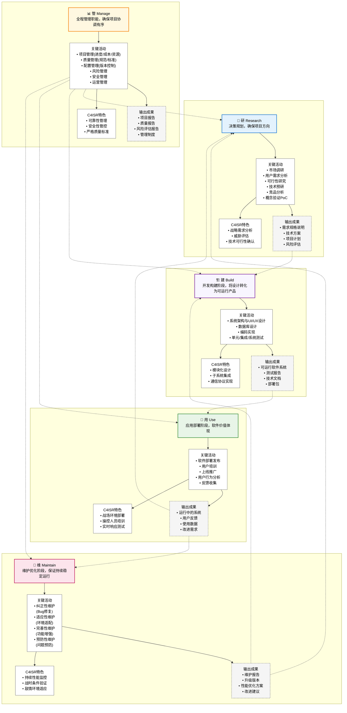

# 研建用管维角色关系与效能指标体系分析

## 概述

本文档基于《研建用管维概念.md》和《阿里云效能指标.md》，深入分析软件生命周期中"研建用管维"五个核心角色的关系，并结合阿里云效能洞察平台的94个指标，构建了一个完整的效能度量体系。该体系特别适用于C4ISR（指挥、控制、通信、计算机、情报、监视和侦察）系统等复杂军用软件系统的开发与管理。

## 一、研建用管维五角色业务关系模型



## 二、效能指标数据流与计算模型

```mermaid
graph TB
    %% 样式定义 - 简洁清晰风格
    classDef dataSource fill:#ffffff,stroke:#333333,stroke-width:1px,color:#000000,font-size:14px
    classDef metricFormula fill:#f8f8f8,stroke:#666666,stroke-width:1px,color:#000000,font-size:14px
    classDef insight fill:#ffffff,stroke:#333333,stroke-width:2px,color:#000000,font-size:14px

    %% 研阶段数据流
    subgraph R_Stage["研 Research - 需求与设计"]
        R_Data["📊 数据源<br/>需求文档记录<br/>设计文档版本<br/>评审会议纪要<br/>变更请求记录<br/>原型验证结果"]
        R_MetricFormula["📈 核心指标与计算公式<br/>RSI(需求稳定性指数)<br/>= 1 - 变更需求数/总需求数<br/><br/>EAR(工时预估准确度)<br/>= 1 - |实际工时-预估工时|/预估工时<br/><br/>RPE(需求处理效率)<br/>= 已完成需求数/(总需求数×经过天数)<br/><br/>对应阿里云指标: ID:45,54,41"]
        R_Insight["💡 效能洞察<br/>需求变更趋势<br/>设计质量水平<br/>评审有效性<br/>需求理解准确度"]

        R_Data --> R_MetricFormula --> R_Insight
    end

    %% 建阶段数据流
    subgraph B_Stage["建 Build - 开发与构建"]
        B_Data["📊 数据源<br/>Git提交记录<br/>代码行数变更<br/>构建执行日志<br/>代码质量扫描<br/>PR/MR记录"]
        B_MetricFormula["📈 核心指标与计算公式<br/>DEI(开发效率指数)<br/>= (提交频率×代码行数)/(开发人数×开发天数)<br/><br/>CQI(代码质量指数)<br/>= (1-缺陷密度/1000)×代码覆盖率×(1-重复率)<br/><br/>BSI(构建稳定性指数)<br/>= 成功构建次数/总构建次数<br/><br/>CRD(代码评审深度)<br/>= 评论总数/(代码行数/1000)<br/><br/>对应阿里云指标: ID:20,1,26,14"]
        B_Insight["💡 效能洞察<br/>开发节奏稳定性<br/>代码质量趋势<br/>集成效率水平<br/>团队协作质量"]

        B_Data --> B_MetricFormula --> B_Insight
    end

    %% 用阶段数据流
    subgraph U_Stage["用 Use - 部署与应用"]
        U_Data["📊 数据源<br/>部署执行记录<br/>系统运行日志<br/>用户反馈数据<br/>性能监控数据<br/>故障恢复记录"]
        U_MetricFormula["📈 核心指标与计算公式<br/>DSR(部署成功率)<br/>= 成功部署/总部署×100%<br/><br/>Availability(系统可用性)<br/>= (总时间-故障时间)/总时间<br/><br/>Lead Time(交付周期)<br/>= 完成时间-创建时间<br/><br/>MTTR(平均故障恢复时间)<br/>= 总恢复时间/故障次数<br/><br/>对应阿里云指标: ID:30,39,51,37"]
        U_Insight["💡 效能洞察<br/>发布稳定性<br/>系统可靠性<br/>交付能力<br/>故障响应能力"]

        U_Data --> U_MetricFormula --> U_Insight
    end

    %% 管阶段数据流
    subgraph M_Stage["管 Manage - 项目管理"]
        M_Data["📊 数据源<br/>工作项状态记录<br/>团队成员工时<br/>项目里程碑<br/>资源分配记录<br/>风险事件日志"]
        M_MetricFormula["📈 核心指标与计算公式<br/>PHI(项目健康度指数)<br/>= (进度+质量+成本)/3<br/><br/>TEI(团队效能指数)<br/>= 完成工作项/(人数×天数)<br/><br/>RUR(资源利用率)<br/>= 实际工时/计划工时×100%<br/><br/>CPI(成本绩效指数)<br/>= 完成预算/实际成本<br/><br/>对应阿里云指标: ID:3,68,7,42"]
        M_Insight["💡 效能洞察<br/>项目健康度<br/>资源配置效率<br/>团队协作水平<br/>成本控制能力"]

        M_Data --> M_MetricFormula --> M_Insight
    end

    %% 维阶段数据流
    subgraph V_Stage["维 Maintain - 维护与优化"]
        V_Data["📊 数据源<br/>缺陷报告记录<br/>修复时间日志<br/>系统性能数据<br/>用户满意度<br/>技术债务评估"]
        V_MetricFormula["📈 核心指标与计算公式<br/>DFE(缺陷修复效率)<br/>= 已修复/总缺陷×100%<br/><br/>MTBF(平均故障间隔时间)<br/>= 总运行时间/故障次数<br/><br/>TDR(技术债务比率)<br/>= 技术债务工时/总工时×100%<br/><br/>缺陷密度<br/>= 缺陷数/千行代码<br/><br/>对应阿里云指标: ID:44,61,78,91"]
        V_Insight["💡 效能洞察<br/>系统质量水平<br/>维护响应能力<br/>技术债务状况<br/>持续改进效果"]

        V_Data --> V_MetricFormula --> V_Insight
    end

    %% 跨阶段数据流关系
    R_Insight -.-> B_Data
    B_Insight -.-> U_Data
    U_Insight -.-> V_Data
    V_Insight -.-> R_Data

    %% 管理数据流贯穿
    M_Data -.-> R_Data
    M_Data -.-> B_Data
    M_Data -.-> U_Data
    M_Data -.-> V_Data

    %% 应用样式
    class R_Data,B_Data,U_Data,M_Data,V_Data dataSource
    class R_MetricFormula,B_MetricFormula,U_MetricFormula,M_MetricFormula,V_MetricFormula metricFormula
    class R_Insight,B_Insight,U_Insight,M_Insight,V_Insight insight
```



## 三、核心指标数学公式设计

### 3.1 研阶段数学模型

**需求稳定性指数 (RSI)**
```
RSI = 1 - (变更需求数 / 总需求数)
```
- 数据源：JIRA需求变更记录
- 计算频率：每日更新
- 阈值设计：RSI ≥ 0.8 优秀，0.6-0.8 良好，0.4-0.6 警告，< 0.4 危险

**工时预估准确度 (EAR)**
```
EAR = 1 - |实际工时 - 预估工时| / 预估工时
```
- 数据源：工时记录系统
- 计算频率：任务完成时计算
- 阈值设计：EAR ≥ 0.9 优秀，0.8-0.9 良好，0.7-0.8 警告，< 0.7 危险

**需求处理效率 (RPE)**
```
RPE = 已完成需求数 / (总需求数 × 经过天数)
```
- 数据源：需求管理系统状态变更
- 计算频率：每日计算
- 阈值设计：RPE ≥ 0.8 优秀，0.6-0.8 良好，0.4-0.6 警告，< 0.4 危险

### 3.2 建阶段数学模型

**代码质量综合指数 (CQI)**
```
CQI = (1 - 缺陷密度/1000) × 代码覆盖率 × (1 - 重复率)
```
- 数据源：SonarQube代码质量扫描
- 计算频率：每次代码提交触发
- 阈值设计：CQI ≥ 0.85 优秀，0.7-0.85 良好，0.5-0.7 警告，< 0.5 危险

**开发效率指数 (DEI)**
```
DEI = (提交频率 × 代码行数) / (开发人数 × 开发天数)
```
- 数据源：Git提交记录
- 计算频率：每日计算
- 阈值设计：DEI ≥ 100 优秀，80-100 良好，60-80 警告，< 60 危险

**构建稳定性指数 (BSI)**
```
BSI = 成功构建次数 / 总构建次数
```
- 数据源：CI/CD构建日志
- 计算频率：实时计算
- 阈值设计：BSI ≥ 0.95 优秀，0.9-0.95 良好，0.8-0.9 警告，< 0.8 危险

**代码评审深度 (CRD)**
```
CRD = 评论总数 / (代码行数 / 1000)
```
- 数据源：Git PR/MR评论记录
- 计算频率：PR合并时计算
- 阈值设计：CRD ≥ 10 优秀，7-10 良好，5-7 警告，< 5 危险

### 3.3 用阶段数学模型

**系统可用性 (Availability)**
```
Availability = (总时间 - 故障时间) / 总时间 × 100%
```
- 数据源：系统监控日志
- 计算频率：实时计算
- 阈值设计：≥ 99.9% 优秀，99.5%-99.9% 良好，99%-99.5% 警告，< 99% 危险

**部署成功率 (DSR)**
```
DSR = 成功部署次数 / 总部署次数 × 100%
```
- 数据源：CI/CD部署日志
- 计算频率：每次部署后更新
- 阈值设计：DSR ≥ 95% 优秀，90%-95% 良好，85%-90% 警告，< 85% 危险

**平均故障恢复时间 (MTTR)**
```
MTTR = Σ故障恢复时间 / 故障次数
```
- 数据源：故障处理记录
- 计算频率：故障解决后更新
- 阈值设计：≤ 1小时 优秀，1-4小时 良好，4-8小时 警告，> 8小时 危险

### 3.4 管阶段数学模型

**项目健康度指数 (PHI)**
```
PHI = (进度达成率 + 质量达成率 + 成本控制率) / 3
```
- 数据源：项目管理系统综合数据
- 计算频率：每周计算
- 阈值设计：PHI ≥ 0.9 优秀，0.8-0.9 良好，0.7-0.8 警告，< 0.7 危险

**团队效能指数 (TEI)**
```
TEI = 完成工作项数 / (团队人数 × 工作天数)
```
- 数据源：工作项完成记录和团队配置
- 计算频率：每日计算
- 阈值设计：TEI ≥ 0.8 优秀，0.6-0.8 良好，0.4-0.6 警告，< 0.4 危险

**资源利用率 (RUR)**
```
RUR = 实际工时 / 计划工时 × 100%
```
- 数据源：工时记录系统
- 计算频率：每周计算
- 阈值设计：85%-100% 优秀，70%-85% 良好，50%-70% 警告，< 50% 危险

### 3.5 维阶段数学模型

**缺陷修复效率 (DFE)**
```
DFE = 已修复缺陷数 / 总缺陷数 × 100%
```
- 数据源：缺陷管理系统
- 计算频率：每日更新
- 阈值设计：DFE ≥ 95% 优秀，90%-95% 良好，80%-90% 警告，< 80% 危险

**平均故障间隔时间 (MTBF)**
```
MTBF = 总运行时间 / 故障次数
```
- 数据源：系统运行监控
- 计算频率：每小时更新
- 阈值设计：≥ 720小时 优秀，360-720小时 良好，168-360小时 警告，< 168小时 危险

**技术债务比率 (TDR)**
```
TDR = 技术债务工时 / 总开发工时 × 100%
```
- 数据源：代码质量分析和工时记录
- 计算频率：每周计算
- 阈值设计：≤ 10% 优秀，10%-20% 良好，20%-30% 警告，> 30% 危险

### 3.6 综合效能指数 (OEI)

**综合效能指数计算公式**
```
OEI = RSI×0.1 + CQI×0.25 + Availability×0.2 + PHI×0.2 + DFE×0.15 + 其他指标×0.1
```

**权重分配说明**：
- 代码质量指数 (CQI)：25% - 最高权重，代码质量是软件质量的基础
- 系统可用性 (Availability)：20% - 系统稳定性直接影响用户体验
- 项目健康度 (PHI)：20% - 项目管理效果的综合体现
- 缺陷修复效率 (DFE)：15% - 维护能力的重要指标
- 需求稳定性 (RSI)：10% - 需求管理的基础指标
- 其他指标：10% - 灵活调整空间

**综合评级标准**：
- OEI ≥ 0.85：卓越 🟢
- 0.7 ≤ OEI < 0.85：良好 🟡
- 0.5 ≤ OEI < 0.7：需改进 🟠
- OEI < 0.5：急需改进 🔴